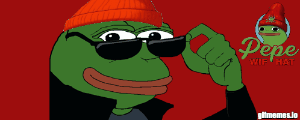

# 👋 Hello, I'm Reda Tahri!  

🎓 **Student at 42 Network**  
🌱 **Currently diving deep into Machine Learning**  
💡 **Driven by curiosity and passion for learning new things**  

---

## 🚀 About Me  
- 📚 I’m a dedicated student at the 42 Network, where I thrive in a collaborative and innovative learning environment.  
- 🤖 Exploring the fascinating world of **Artificial Intelligence** and **Machine Learning** to build smarter, data-driven solutions.  
- 🔍 I’m always on the lookout for opportunities to learn and grow—new challenges excite me!  

---

## 🛠️ Skills  
- **Programming Languages**: C, C++, Python, 
- **Development Tools**: Git, Docker, VS Code, VIM  
- **Special Interests**: Algorithms, Binary exploitation, Data Science, AI  

---

## 🌟 What I’m Up To  
- 🧠 Building projects in **Machine Learning** and refining my skills in **data analysis**.  
- 🚀 Contributing to open-source projects to learn and give back to the community.  
- 📖 Constantly learning new technologies and enhancing my technical toolbox.  

---

Thank you for stopping by! Don’t forget to check out my repositories and feel free to collaborate.  
                      Let’s make something amazing together! 🚀  

  
